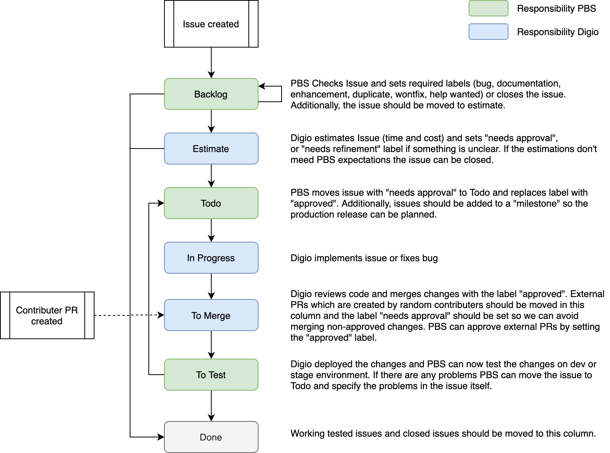

l# Contributing to HealthCheck

This document provides guidelines on how to contribute to the HealthCheck Project. 
Make sure to read it thoroughly before trying to contribute in any way.

## Contents

- [Communication](#communication)
- [Project Bard and Collaboration between PBS, Digio GmbH and Contributors](#project-board-and-collaboration-between-digio-and-pbs)
- [Reporting Bugs](#reporting-bugs)
    - [Before Submitting A Bug Report](#before-submitting-a-bug-report)
    - [How Do I Submit A (Good) Bug Report](#how-do-i-submit-a-good-bug-report)
- [Requesting Features](#requesting-features)
- [Code Style](#code-style)
- [Pull Request Procedure](#pull-request-procedure)
    - [PR Issue Templates](#issue-templates)
    - [Working with Forks](#working-with-forks)

## Communication

All communication happens through GitHub Issues. If you find a bug or want to add a feature refer to the 
appropriate guides below: 
- [Bug Report](#reporting-bugs)
- [Feature Request](#requesting-features)

## Project Board and collaboration between Digio and PBS 

This chart defines the flow of issues and bugs in the project board. 
Additionally, it highlights the responsible party for each stage and which action is possible to be taken next.



## Reporting Bugs

This section guides you through submitting a bug report for HealthCheck. 
Following these guidelines helps maintainers and the community understand your report :pencil:, reproduce the 
behavior :computer:, and find related reports :mag_right:.

#### Before Submitting A Bug Report

* **Check existing issues.** Maybe an issue was already opened regarding your problem, if so avoid creating duplicates.

> **Note:** If you find a **Closed** issue that seems like it is the same thing that you're experiencing, open
> a new issue and include a link to the original issue in the body of your new one.

#### How Do I Submit A (Good) Bug Report

1. Use the Bug Report issue template
2. Be concise and try to provide as much information as possible
3. Use additional debugging tools (xdebug, Chrome Dev Console) to provide details if you can reproduce the bug locally.

## Requesting Features

To request new features use the "Feature Request" issue template. Again, be concise and add as many details as possible.
If any additional dependencies (3rd party APIs or other systems) are needed, mention it and explain why and how it
relates to your feature.

## Code Style

Please follow the PSR-12 code style (for PHP), the CI will check the code and fail if there are any errors. 

## Pull Request Procedure

To make a pull request, you will need a GitHub account; if you are unclear on
this process, see GitHub's documentation on
[forking](https://help.github.com/articles/fork-a-repo) and
[pull requests](https://help.github.com/articles/using-pull-requests). Pull
requests should be targeted at the `develop` branch. Before creating a pull
request, go through this checklist:

1. Create a feature branch off of `develop` so that changes do not get mixed up.
2. Lint PSR-12 (check README.md for a guide on how to check your code)
3. Run tests (check README.md for a guide on how to run the tests)

Pull requests will be reviewed by the maintainers, they will give
feedback on the style and substance of the change/fix.
Please include tests for your changes where possible.

### Issue Templates

Please use the appropriate issue templates for you PRs. You can choose from a "Bug Fix" and "Feature Change" template.

### Working with Forks

```
# First you clone the original repository
git clone git@github.com:digio-ch/pbs-healthcheck-core.git

# Next you add a git remote that is your fork:
git remote add fork git@github.com:<YOUR-GITHUB-USERNAME-HERE>/pbs-healthcheck-core.git

# Next you fetch the latest changes from origin for develop:
git fetch origin
git checkout develop

# Next you create a new feature branch off of develop:
git checkout my-feature-branch

# Now you do your work and commit your changes:
git add -A
git commit -m "fix: this is the message. Closes #123"

# And the last step is pushing this to your fork
git push -u fork my-feature-branch
```

Now go to the project's GitHub Pull Request page and click "New pull request"
